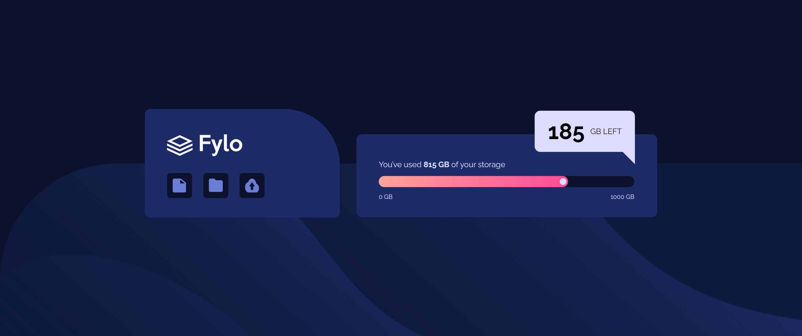
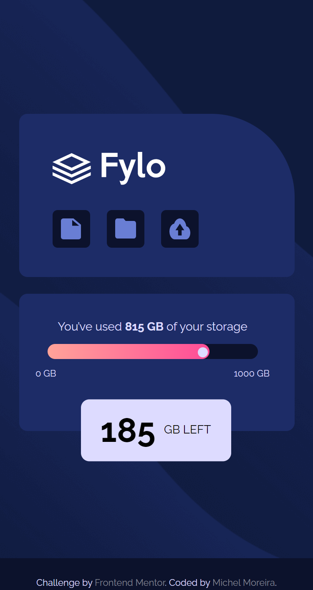

# Frontend Mentor - Fylo data storage component solution

This is a solution to the [Fylo data storage component challenge on Frontend Mentor](https://www.frontendmentor.io/challenges/fylo-data-storage-component-1dZPRbV5n).

## Table of contents

- [Overview](#overview)
  - [The challenge](#the-challenge)
  - [Screenshot](#screenshot)
  - [Links](#links)
- [My process](#my-process)
  - [Built with](#built-with)
  - [What I learned](#what-i-learned)
  - [Useful resources](#useful-resources)
- [Author](#author)
- [Acknowledgments](#acknowledgments)

## Overview

### The challenge

Users should be able to:

- View the optimal layout for the site depending on their device's screen size

### Screenshot

-Desktop

- Mobile

### Links

- Solution URL: [Add solution URL here](https://your-solution-url.com)
- Live Site URL: [Add live site URL here](https://your-live-site-url.com)

## My process

### Built with

- Semantic HTML5 markup
- CSS custom properties
- Flexbox

### What I learned

- That project made me learn about semantic HTML5

- Working with flexible display using the flexbox properties, positioning elements on the screen.

- Working with external fonts (Google fonts) to improve a better custom apparence.

- Working with borders.

- To make a progress bar.

### Useful resources

- [Progress Bar](https://www.youtube.com/watch?v=CldkblcJJTw&ab_channel=Rogers) - This video helped me how to make a progress bar, indeed, it was a challenge. I will use it going forward.
- [Chat Ballon](https://pt.stackoverflow.com/questions/30134/bot%C3%B5es-pontudos-e-bal%C3%B5es-de-texto) - In this forum, people helped me create a different border and made me look at the subject with more creative ideas.
- [CSS Tool](https://cssgenerator.org/) - This site improves the way we manipulate some CSS properties, I recommend it to anyone who wants to speed up their work.

## Author

- Github - [Michel Moreira](https://github.com/michel-moreira)
- Frontend Mentor - [@michel-moreira](https://www.frontendmentor.io/profile/michel-moreira)
- LinkdIn - [Michel Moreira](https://www.linkedin.com/in/michel-moreira-760142254/)

## Acknowledgments

To the team of users from the Frontend Mentor that helped me with useful suggestions and feedbacks, promoting an excitement and happiness in the matter of coding. To my personal sponsors (family and friends). To everybody that love coding my whole gratitude.
